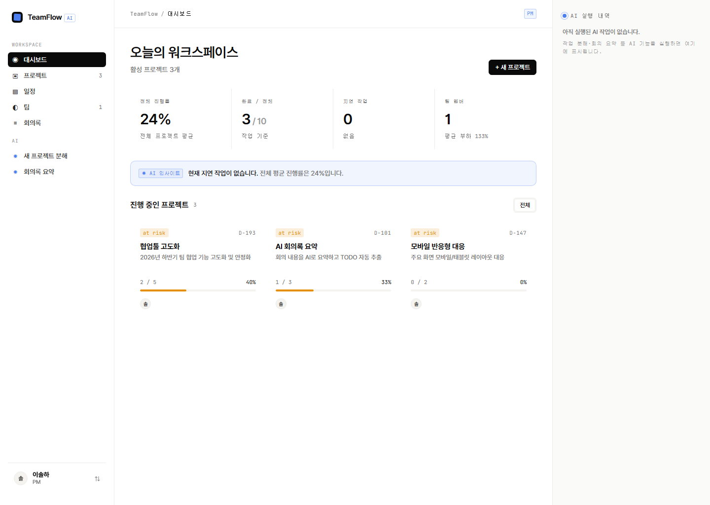

# TeamFlow

AI가 팀 프로젝트의 일정·업무 분담·회의 정리를 돕는 팀 협업 도구.
React 프론트엔드와 Spring Boot 백엔드로 구성된 모노레포입니다.



## Deployment

서비스 배포 주소

- Frontend & Backend: [http://113.198.66.75:13137/](http://113.198.66.75:13137/)

> 배포 서버에는 실제 OpenAI API 키가 설정되어 있어 AI 작업 분해·회의 요약·위험 분석 기능이 실제 GPT 모델로 동작합니다.

## Repository Structure

본 프로젝트는 빠른 개발과 유지보수를 위해 프론트엔드와 백엔드를 하나의
레포지토리(Monorepo)로 관리합니다.

`CLAUDE.md`에는 프로젝트 구조, 설계 결정, 변경 이력 및 개발 규칙을 기록하여
AI 기반 개발 도구가 이전 작업 맥락을 참고할 수 있도록 구성했습니다.

향후 서비스 규모가 확장될 경우 Frontend와 Backend를 독립 레포지토리로 분리할 예정입니다.

## 구성

```
TeamFlow/
├── frontend/           # React + Vite SPA   (자세히: frontend/README.md)
├── backend/            # Spring Boot + JPA   (자세히: backend/CLAUDE.md)
└── docker-compose.yml  # 프론트 + 백엔드 한 번에 실행
```

## 빠른 시작 — Docker (권장)

도커만 있으면 한 번에 실행됩니다.

```bash
# (선택) AI 기능을 쓰려면 .env에 OpenAI 키 입력
#   .env 파일이 이미 있습니다. OPENAI_API_KEY=sk-... 채우면 됩니다.
docker compose up --build
```

| 서비스 | 주소 |
|--------|------|
| 프론트엔드 | http://localhost:3000 |
| 백엔드 API | http://localhost:8080/api/v1 |
| Swagger UI | http://localhost:8080/swagger-ui.html |

종료:
```bash
docker compose down
```

### 첫 계정 만들기

첫 실행 후 회원가입 화면에서 역할을 `PM`으로 선택하면 프로젝트 생성, 팀원 초대, PM 대시보드 등 관리자 기능을 사용할 수 있습니다.

> Docker는 **PostgreSQL**을 사용하며 데이터는 `postgres_data` 볼륨에 영속 저장됩니다. `docker compose down -v` 로 볼륨까지 삭제하면 초기화됩니다.

### AI 기능 (OpenAI)

`.env`의 `OPENAI_API_KEY`를 채우면 **AI 작업 분해**(프로젝트 생성), **AI 회의 요약**, **AI 위험 분석**이 실제 OpenAI로 동작합니다.
키가 없으면 자동으로 목(mock) 응답을 반환하여 AI 흐름을 그대로 체험할 수 있습니다.

```bash
# .env
OPENAI_API_KEY=sk-여기에_키
OPENAI_MODEL=gpt-4o-mini   # 선택
```
키를 바꾼 뒤에는 백엔드만 재시작: `docker compose up -d --build backend`

> 프론트(nginx)가 `/api` 요청을 백엔드 컨테이너로 프록시하므로 CORS 설정 없이 동작합니다.

## 개별 실행 (도커 없이)

**백엔드** (Java 17)
```bash
cd backend
./gradlew :backend:bootRun        # macOS/Linux
# 또는
.\gradlew.bat :backend:bootRun    # Windows PowerShell
# → http://localhost:8080  (active profile: local, H2 인메모리)
```

**프론트엔드** (Node 20)
```bash
cd frontend
npm install
npm run dev
# → http://localhost:5173  (/api 요청은 :8080으로 프록시)
```

## 기술 스택

| 영역 | 스택 |
|------|------|
| Frontend | React 18, Vite 5, React Router 6, Context API |
| Backend | Java 17, Spring Boot 3.3, Spring Data JPA, Spring Security(JWT), springdoc(Swagger) |
| DB | H2(로컬) / PostgreSQL(도커·운영) |
| 빌드/배포 | Gradle, Docker, nginx |

## 주요 기능

- **인증** — 회원가입/로그인/로그아웃 (JWT)
- **프로젝트** — 목록·상세·생성, 멤버 관리, 진행률·health 자동 집계
- **태스크** — 보드/일정, 상태·담당자·브랜치 연결, 내 작업, GitHub PR 머지 웹훅 연동
- **대시보드** — 개인 워크로드·내 작업, PM용 팀 현황·팀 워크로드
- **회의록** — AI 요약, TODO 추출, 저장된 회의록 목록 조회, 회의 TODO의 태스크 전환
- **AI Agent** — 요구사항 질문 생성, 태스크 분해, 담당자 추천, 병목/위험 분석, 회의 요약
- **AI 실행 내역** — 자동 모니터링·회의 요약 결과를 우측 사이드바에 실시간 표시 (60초 폴링)
- **워크스페이스/초대** — 워크스페이스 단위 데이터 격리, 초대 링크 생성·수락
- **설정** — 프로필·비밀번호 변경·회원 탈퇴·팀원 초대
- **관리자** — 멤버 목록(PM 전용)

## AI Agent 구성

백엔드의 `domain/ai/agent` 폴더는 다음 5개 Agent로 구성됩니다.

| Agent | 역할 |
|-------|------|
| `RequirementAgent` | 기능 설명을 보고 추가 질문 3~5개 생성 |
| `TaskDecomposeAgent` | 기능 설명과 답변을 프로젝트/태스크 후보로 분해 |
| `AssignmentAgent` | 팀원 역할·스킬을 바탕으로 태스크 담당자 추천 |
| `RiskAgent` | 병목 리포트를 위험 항목과 권고사항으로 분석 |
| `MeetingAgent` | 회의 내용을 요약하고 TODO를 추출 |

## 환경 변수

| 변수 | 위치 | 기본값 | 설명 |
|------|------|--------|------|
| `OPENAI_API_KEY` | .env | (빈 값) | OpenAI API 키. 미설정 시 목(mock) 응답으로 동작 |
| `OPENAI_MODEL` | .env | `gpt-4o-mini` | 사용할 OpenAI 모델 |
| `DB_URL` | docker-compose | `jdbc:postgresql://postgres:5432/teamflow` | PostgreSQL 접속 URL |
| `DB_USERNAME` | docker-compose | `teamflow` | DB 사용자 |
| `DB_PASSWORD` | docker-compose | `teamflow1234` | DB 비밀번호 (운영 시 교체) |
| `GITHUB_WEBHOOK_SECRET` | .env | (빈 값) | GitHub 웹훅 서명 검증 secret. 미설정 시 검증 생략 |
| `JWT_SECRET` | docker-compose | 내장 기본값 | JWT 서명 키 (운영 시 반드시 교체) |
| `VITE_API_BASE_URL` | frontend | `/api/v1` | API 베이스 URL (미설정 시 프록시 사용) |

## 더 보기

- 프론트엔드 상세: [`frontend/README.md`](frontend/README.md)
- 백엔드 상세/아키텍처: [`backend/CLAUDE.md`](backend/CLAUDE.md)
- API 명세: Swagger UI (`/swagger-ui.html`)
